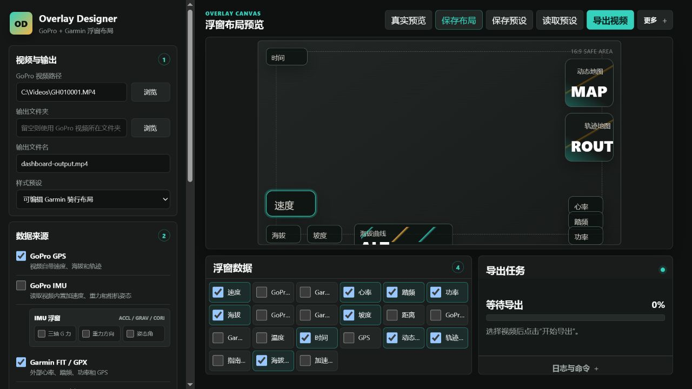

# GoPro / Garmin Overlay Designer

**English** | [中文说明](#中文说明)

A local Windows application for designing and rendering telemetry overlays on
GoPro videos. It combines the GPS and IMU metadata embedded in GoPro footage
with optional Garmin FIT/GPX activity data, then lets you arrange gauges, maps,
charts, and metrics visually before exporting the finished video.

Built on [time4tea/gopro-dashboard-overlay](https://github.com/time4tea/gopro-dashboard-overlay),
the project adds a browser-based layout editor, editable upstream XML presets,
real-frame previews, render progress, hardware encoder detection, Mapbox
satellite imagery, and GoPro/Garmin GPS comparison and alignment tools.



## Key Features

- Read speed, altitude, GPS tracks, and IMU data directly from supported GoPro videos.
- Add Garmin heart rate, cadence, power, altitude, speed, and route data from FIT/GPX files.
- Align GoPro and Garmin telemetry by timestamp or matched GPS positions.
- Drag, resize, duplicate, hide, and remove overlay widgets in a visual canvas.
- Start from bundled upstream XML layouts and continue editing them visually.
- Export a burned-in video, a transparent overlay MOV, or a clean video copy.
- Use CyclOSM, OpenStreetMap, or Mapbox satellite map tiles.
- Detect CPU, NVIDIA NVENC/CUDA, Intel QSV, and AMD AMF encoding options.
- Monitor render progress, cancel running jobs, and review recent render logs.

## Requirements

- 64-bit Windows 10 or Windows 11
- Python 3.11 or newer
- FFmpeg with H.264 support
- A GoPro MP4 file; Garmin FIT/GPX data is optional

## Quick Start

Download `OverlayDesignerWindows.zip` from the
[latest release](https://github.com/apmata6668/gopro-garmin-overlay-designer/releases/latest),
extract it, and double-click:

```text
setup-and-start.bat
```

The setup script creates a local Python environment and installs the pinned
`gopro-overlay==0.134.0` dependency. Add FFmpeg to `PATH`, or select its `bin`
folder in the application's advanced settings.

To install from a Git clone instead, run:

```powershell
powershell -ExecutionPolicy Bypass -File .\install-gopro-overlay-windows.ps1
```

Then launch the application with `start-panel.bat`.

## Data Sources

For action sports such as downhill and enduro MTB, a useful starting point is:

- GoPro for speed, short-term movement, and acceleration.
- Garmin for heart rate, cadence, power, and usually altitude.
- Timestamp alignment by default; GPS position alignment when both tracks are reliable.

All video and activity processing happens locally. Runtime layouts, settings,
logs, and map caches are stored under `%LOCALAPPDATA%\OverlayDesigner`. Mapbox
access tokens are not included in this repository or release package; users add
their own token locally when satellite imagery is needed.

See [Privacy and Data Handling](docs/privacy.md),
[Packaging](docs/packaging.md), and [Third-Party Notices](THIRD_PARTY_NOTICES.md)
for additional details.

## 中文说明

一个在 Windows 本地运行的可视化面板，用于把 GoPro GPS/IMU 与 Garmin FIT/GPX 数据制作成视频浮窗。项目基于 [time4tea/gopro-dashboard-overlay](https://github.com/time4tea/gopro-dashboard-overlay)，支持拖动布局、官方模板、真实帧预览、地图、GPU 编码和一键导出。

## 功能

- 读取 GoPro 视频内置 GPS、海拔、速度和 IMU 数据。
- 合并 Garmin 心率、踏频、功率、海拔和 GPS。
- 按设备时间或 GPS 位置拟合 GoPro 与 Garmin 数据。
- 自定义浮窗、圆角背景、中文字体、位置和尺寸。
- 使用官方 XML 模板，并继续拖动或添加自定义浮窗。
- 输出烧录视频、透明浮窗 MOV 或无浮窗视频。
- 支持 CyclOSM、OpenStreetMap 和 Mapbox 卫星地图。
- 检测 CPU、NVIDIA NVENC/CUDA、Intel QSV 和 AMD AMF。
- 显示导出进度、取消任务并保留最近十条日志。

## 系统要求

- Windows 10/11 64 位
- Python 3.11 或更新版本
- FFmpeg（建议 Windows essentials build）
- GoPro MP4；Garmin FIT/GPX 为可选数据源

## 安装

在项目目录打开 PowerShell：

```powershell
powershell -ExecutionPolicy Bypass -File .\install-gopro-overlay-windows.ps1
```

安装脚本会创建 `venv`、安装固定版本 `gopro-overlay==0.134.0`，并应用 Mapbox 与 GPS 位置拟合兼容模块。

FFmpeg 可以加入 `PATH`，也可以启动后在“设置”中选择其 `bin` 文件夹。

## 启动

双击：

```text
start-panel.bat
```

程序会选择从 `8765` 开始的可用本地端口并打开浏览器。PowerShell 窗口需要在使用期间保持打开。

## 推荐数据方案

- 速度、短时变化与加速度：优先使用 GoPro。
- 心率、踏频和功率：使用 Garmin。
- 海拔：通常优先 Garmin，但应根据设备与活动检查。
- 默认先使用时间拟合；两条 GPS 轨迹都可靠时再尝试位置拟合。

## Mapbox 卫星地图

1. 在 Mapbox 创建只包含所需公开读取权限的 Access Token。
2. 打开“输出设置 → 地图、代理与编码”。
3. 选择“Mapbox 卫星影像”，输入 Token 并保存本机设置。

Token 存储在 `%LOCALAPPDATA%\OverlayDesigner\settings.json`，不会保存到仓库、预设文件或导出日志。发布截图和日志前仍应检查敏感信息。

## 导出 GoPro GPS

导出每秒一个已锁定定位点的 GPX：

```powershell
.\venv\Scripts\python.exe .\venv\Scripts\gopro-to-gpx.py `
  --every 1 --only-locked `
  "input.mp4" "gopro-track.gpx"
```

导出包含速度、坡度、距离和三轴加速度的 CSV：

```powershell
.\venv\Scripts\python.exe .\venv\Scripts\gopro-to-csv.py `
  --every 1 --only-locked `
  "input.mp4" "gopro-telemetry.csv"
```

## 数据和隐私

视频与 FIT/GPX 文件只在本机处理。运行时布局、缓存和日志位于：

```text
%LOCALAPPDATA%\OverlayDesigner
```

请勿向 GitHub 上传真实视频、FIT/GPX、地图缓存、Token 或未经匿名化的日志。详见 [隐私说明](docs/privacy.md)。

## 开发与发布

```powershell
.\venv\Scripts\python.exe -m pip install -r requirements-dev.txt
.\venv\Scripts\python.exe -m pytest
```

Windows 安装包与 EXE 规划见 [打包说明](docs/packaging.md)。贡献前请阅读 [CONTRIBUTING.md](CONTRIBUTING.md)，安全问题见 [SECURITY.md](SECURITY.md)。

## 已知限制

- 已经烧录进视频的浮窗无法从成片中无损删除，请保留原片或使用透明浮窗模式。
- 在线地图受网络、代理、服务条款和请求配额影响。
- GPS 位置拟合不能修复原始设备的定位漂移或错误速度。
- 硬件编码可用性取决于 FFmpeg 构建、显卡与驱动。

## 许可证

本项目采用 [GPL-3.0-or-later](LICENSE)。第三方组件与地图服务说明见 [THIRD_PARTY_NOTICES.md](THIRD_PARTY_NOTICES.md)。
